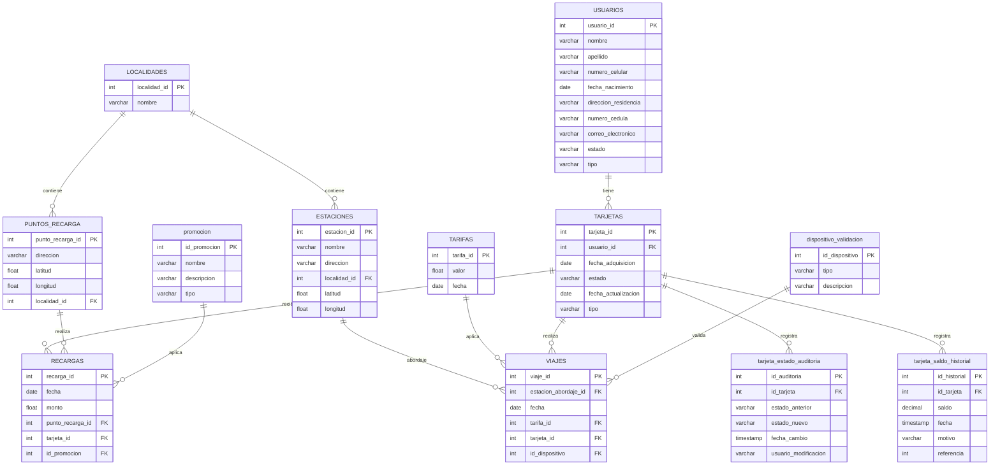

# Sistema de Recargas y Viajes

## Diagrama Entidad-Relación



## Descripción

Este sistema gestiona recargas y viajes para un sistema de transporte público. Incluye gestión de usuarios, tarjetas, recargas, viajes y dispositivos de validación.

## Estructura del proyecto


```
sistema-recargas-bd/
├── scripts/
│   ├── 00_tablas.sql          # Creación de tablas base
│   ├── 01_modificaciones.sql  # Modificaciones a tablas
│   ├── 02_nuevas_tablas.sql   # Nuevas entidades
│   ├── 03_consultas.sql       # Consultas de análisis
│   └── inserts
└── README.md
```

## Tablas Principales
```
Tablas Base
USUARIOS: Información de usuarios del sistema
TARJETAS: Tarjetas asociadas a usuarios
LOCALIDADES: Divisiones geográficas
PUNTOS_RECARGA: Lugares para recargar tarjetas
ESTACIONES: Puntos de abordaje
TARIFAS: Histórico de tarifas
RECARGAS: Registro de recargas
VIAJES: Registro de viajes
```
## Nuevas Tablas
```
promocion: Gestión de promociones
dispositivo_validacion: Dispositivos para validar viajes
tarjeta_estado_auditoria: Historial de estados de tarjetas
tarjeta_saldo_historial: Historial de saldos
```
## Consultas Principales
Auditoría de Estados

- Cambios de estado por mes
- Top 5 tarjetas con más cambios
- Análisis de Promociones

- Recargas con promociones aplicadas
- Montos totales por tipo de promoción
- Dispositivos de Validación

- Buscar si hay algun saldo específico
- Historial de saldo con información del usuario
- Tarjetas con su historial de saldo más reciente

## Instrucciones de Implementación
Crear Base de Datos
```
CREATE DATABASE sistema_recargas_viajes_grupo[X] 
TEMPLATE sistema_recargas_viajes;
Ejecutar Scripts
```
Ejecutar scripts en orden numérico
Verificar creación de tablas
Cargar datos de prueba
Configuración de Conexión
```
Host: 149.130.169.172
Port: 33333
User: admin
Pass: Pass!__2025!
```
## Mejoras Implementadas
- Auditoría de estados de tarjetas
- Sistema de promociones
- Registro de dispositivos de validación
- Historial detallado de saldos
## Consideraciones Técnicas
- PostgreSQL como motor de base de datos
- Uso de foreign keys para integridad referencial
- Índices para optimización de consultas
- Campos de auditoría para seguimiento de cambios
