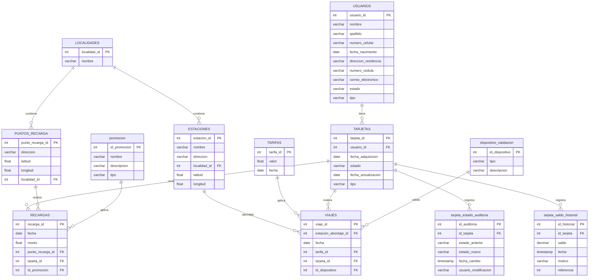

# sistema-recargas-bd-final

## Diagrama Entidad-Relación

## Descripción

Este sistema gestiona recargas y viajes para un sistema de transporte público. Incluye gestión de usuarios, tarjetas, recargas, viajes y dispositivos de validación.

## Tablas Principales
- Usuarios
- Tarjetas
- Recargas
- Viajes
- Promociones
- Dispositivos de validación
